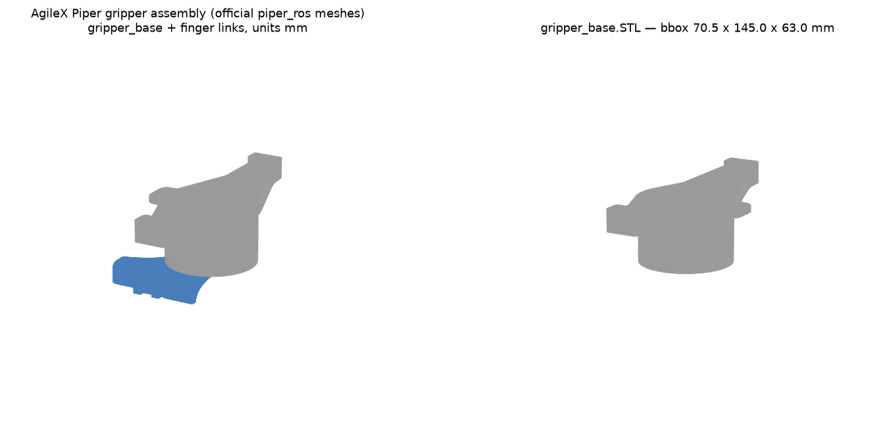

# picamera2 mount for the AgileX Piper end effector — design resources

Design-resource roundup for [borysgroup/monark-cloud-infra#5](https://github.com/borysgroup/monark-cloud-infra/issues/5): a 3D-printed mount that attaches a Raspberry Pi camera (picamera2 stack, e.g. Camera Module 3 + Pi Zero 2 W) near the Piper two-finger gripper.

## 1. AgileX Piper — official design files and specs

### CAD downloads (hosted on AgileX's Shopify CDN, linked from [AIFitLab's product page](https://aifitlab.com/products/agilex-piper-robotic-arm); all links verified live 2026-09-04)

| File | Size | Link |
|---|---|---|
| Piper arm, full STEP assembly | ~11 MB | [AgileX_PiPER_Robotic_Arm_STP.zip](https://cdn.shopify.com/s/files/1/0673/6848/5000/files/AgileX_PiPER_Robotic_Arm-1-STP.zip?v=1782225362) |
| **Piper arm with gripper, STEP** (recommended starting point) | ~11.8 MB | [AgileX_PiPER_with_Gripper_STP.zip](https://cdn.shopify.com/s/files/1/0673/6848/5000/files/AgileX_PiPER_with_Gripper-1-STP.zip?v=1782225359) |
| **Two-finger gripper alone, STEP** | ~2.9 MB | [AgileX_Gripper.STEP](https://cdn.shopify.com/s/files/1/0673/6848/5000/files/AgileX_Gripper-1-STP.STEP?v=1782224095) |
| End-effector flange, STEP | ~156 KB | [AgileX_Flange.STP](https://cdn.shopify.com/s/files/1/0673/6848/5000/files/AgileX_Flange-1-STP.STEP?v=1782223956) |
| Product user manual (PDF) | ~5.8 MB | [AgileX_PIPER_Product_User_Manual.pdf](https://cdn.shopify.com/s/files/1/0673/6848/5000/files/AgileX_PIPER_Product_User_Manual.pdf?v=1782228874) |

Additional official sources:

- [agilexrobotics/piper_ros](https://github.com/agilexrobotics/piper_ros) — URDF + mesh files, including [`gripper_base.STL`](https://github.com/agilexrobotics/piper_ros/blob/master/src/piper_description/meshes/gripper_base.STL) and finger links `link7.STL`/`link8.STL` (meters; multiply by 1000 for mm). Handy for quick mock-ups if you'd rather not import the full STEP.
- [agilexrobotics/piper_sdk](https://github.com/agilexrobotics/piper_sdk) — Python SDK (CAN control), useful later for coordinating captures with arm motion.
- [Piper product page (global.agilex.ai)](https://global.agilex.ai/products/piper) — headline specs: 6 DOF, 1.5 kg payload, 626 mm reach, ±0.1 mm repeatability, 4.2 kg arm mass.
- Retail/spec mirrors: [Generation Robots gripper page](https://www.generationrobots.com/en/404354-gripper-for-piper-robotic-arm-agilex.html), [Robotopian](https://robotopian.com/products/agilex-piper-robotic-arm), [MyBotShop](https://www.mybotshop.de/AgileX-Piper_3), [RoboWorks](https://www.roboworks.net/store/p/piper).

### Mechanical interface facts (from the user manual, §2.4.2 and §2.9)

- The J6 end can carry tools via the flange: an M3×4 limit bolt (head Ø4.5) at the upper-left of the J6 motor indexes the flange, which is then secured with **6× M3×8 hex-socket countersunk bolts**.
- The gripper (or teach pendant) slides onto the flange with a keyed ("fool-proof") back cover and is fixed with **M3×14 hex-socket countersunk bolts** — these existing bolt locations are the most promising anchor points for a camera mount that clamps to or replaces gripper-mounting hardware.
- **Power at the end joint: XT30 2+2 connector, 24 V / 2 A max** (power + CAN; manual warns the CAN lines are for AgileX equipment only). A 24 V→5 V buck converter could power a Pi Zero 2 W from this, but note the gripper itself is rated ≤50 W max / ~30 W average, so check the budget — the same debate played out for the UR3e in [ac-dev-lab#328](https://github.com/AccelerationConsortium/ac-dev-lab/issues/328) and ended with "power the Pi separately."

### Gripper envelope (measured from official `piper_ros` meshes)

- `gripper_base.STL` bounding box: **≈ 70.5 × 145 × 63 mm**; stroke 0–100 mm (rated 70 mm), clamp force 40 N rated / 50 N max, mass 500 g ([Generation Robots specs](https://www.generationrobots.com/en/404354-gripper-for-piper-robotic-arm-agilex.html)).
- J6 wrist mesh (`link6.STL`) is ≈ Ø35 × 4 mm at the interface.

*Rendered from the official `piper_ros` STLs (this repo, `docs/piper-picamera2-mount/images/`).*

## 2. Raspberry Pi camera — mechanical references

| Resource | Link |
|---|---|
| Camera Module 3 mechanical drawing (standard) | [PDF](https://datasheets.raspberrypi.com/camera/camera-module-3-standard-mechanical-drawing.pdf) |
| Camera Module 3 mechanical drawing (wide) | [PDF](https://datasheets.raspberrypi.com/camera/camera-module-3-wide-mechanical-drawing.pdf) |
| Camera Module 3 STEP models | [ZIP](https://datasheets.raspberrypi.com/camera/camera-module-3-step.zip) |
| Camera Module 3 product brief | [PDF](https://datasheets.raspberrypi.com/camera/camera-module-3-product-brief.pdf) |
| Pi Zero 2 W mechanical drawing | [PDF](https://datasheets.raspberrypi.com/rpizero2/raspberry-pi-zero-2-w-mechanical-drawing.pdf) |
| Camera documentation hub | [raspberrypi.com/documentation/accessories/camera](https://www.raspberrypi.com/documentation/accessories/camera.html) |

Key dimensions from the Camera Module 3 drawing (verified against the PDF):

- Board: **25 × 23.862 mm**, ~11.5 mm deep including lens stack.
- **4× Ø2.2 mm mounting holes** (fit M2 screws or heat-set inserts), hole centers 2.0 mm from board edges → hole pattern **21 × 12.5 mm**.
- FoV: 66° horizontal (standard) / 102° (wide). The xArm mount experience below suggested the wide version is worth considering for close-range gripper views.

## 3. Prior art in AccelerationConsortium/ac-dev-lab (closest precedents)

### [Issue #527 — Camera mount for xArm gripper](https://github.com/AccelerationConsortium/ac-dev-lab/issues/527) (closed: working)

The most directly transferable precedent: a picam mount cantilevered off a gripper, iterated in Fusion 360, printed in PETG (tilted on the plate to keep supports off mating surfaces). Design links from the issue:

- picam mount: <https://a360.co/4kbOj6e>
- Camera stand (courtesy of SDL2): <https://a360.co/4ihv4Z0> ([install video](https://youtu.be/VnL-PbB5gLM))
- Latest iteration by @pranshu-ui: <https://a360.co/486dxhx>

As-printed (PETG) on the xArm:

### [Issue #328 — PiCamera 2 mount and electrical setup for UR3e](https://github.com/AccelerationConsortium/ac-dev-lab/issues/328) (open)

Mount + power design for a Robotiq gripper on a UR3e. Highlights:

- @xiaomguo's printed mount holding camera + Pi Zero 2 W at the wrist:

  

- @kelvinchow23's revision for a full-size Pi using off-the-shelf standoffs instead of printed ones (easier support-free printing): <https://a360.co/3HuLe3j>. Hardware: 4× M2.5 nuts, 4× M2.5×6 screws, 4× M2.5×6 M-F standoffs, 1× M4×10 screw (e.g. from the [Adafruit M2.5 kit](https://www.digikey.ca/en/products/detail/adafruit-industries-llc/3299/6596885)).

  

- Long power discussion (M8 tool-connector splitters, 24 V→5 V bucks): conclusion was that pulling from the arm's tool power risks browning out gripper peaks — powering the Pi separately (long USB run with cable management, or magnetic quick-disconnect USB) was the pragmatic answer. Directly applicable to the Piper's 24 V / 2 A XT30 budget.
- @kelvinchow23's Pi camera server one-liner install: [kelvinchow23/robot_system_tools `pi_cam_server`](https://github.com/kelvinchow23/robot_system_tools/tree/master/pi_cam_server).

### Other related items

- [PR #292](https://github.com/AccelerationConsortium/ac-dev-lab/pull/292) — picam mount v2 design files committed to the repo ([`.f3d`](https://github.com/AccelerationConsortium/ac-dev-lab/blob/main/src/ac_training_lab/picam/_design/picam3-mount-v2.f3d), [`.stl`](https://github.com/AccelerationConsortium/ac-dev-lab/blob/main/src/ac_training_lab/picam/_design/picam3-mount-v2.stl), [`.3mf`](https://github.com/AccelerationConsortium/ac-dev-lab/blob/main/src/ac_training_lab/picam/_design/picam-mount-v2%20%5Bx8%5D.3mf); Fusion: <https://a360.co/4kbOj6e>) — a proven picam3 board-clamp geometry to reuse for the camera-holding half of the Piper mount.
- [Issue #158 — Custom toolhead camera for Bambu Lab A1 Mini](https://github.com/AccelerationConsortium/ac-dev-lab/issues/158) and [PR #289](https://github.com/AccelerationConsortium/ac-dev-lab/pull/289)/[#297](https://github.com/AccelerationConsortium/ac-dev-lab/pull/297) (picam bill of materials).
- [Issue #11 — Equipment monitoring using Pi Zero 2 W cameras](https://github.com/AccelerationConsortium/ac-dev-lab/issues/11); [picam device docs](https://ac-training-lab.readthedocs.io/en/latest/devices/a1_cam.html).
- [PR #461 — mechanical design attaching to handle with tie rod](https://github.com/AccelerationConsortium/ac-dev-lab/pull/461) (closed WIP; alternative clamping approach).

## 4. Suggested design approach (for Xiaoman/Kelvin, per issue scope)

1. Import [AgileX_PiPER_with_Gripper_STP.zip](https://cdn.shopify.com/s/files/1/0673/6848/5000/files/AgileX_PiPER_with_Gripper-1-STP.zip?v=1782225359) into Fusion 360 and design in place around the gripper base (≈70.5 × 145 × 63 mm envelope).
2. Anchor either to the flange's M3 countersunk bolt circle (swap M3×8 bolts for longer ones through a mount plate) or as a clamp-on collar around the gripper base — the xArm mount ([#527](https://github.com/AccelerationConsortium/ac-dev-lab/issues/527)) used the clamp/bracket route and it printed and held fine in PETG.
3. Reuse the picam3 board-clamp geometry from [picam3-mount-v2.f3d](https://github.com/AccelerationConsortium/ac-dev-lab/blob/main/src/ac_training_lab/picam/_design/picam3-mount-v2.f3d) (4× M2 on 21 × 12.5 mm pattern), angled so the fingers occlude as little as possible — the #527 iterations specifically moved the camera forward for this reason.
4. Mind J6 rotation (±120°, not continuous): fix the camera to the gripper's reference frame so the view stays finger-aligned, mirroring the reasoning in [#328](https://github.com/AccelerationConsortium/ac-dev-lab/issues/328).
5. Power the Pi Zero 2 W separately at first (USB run with strain relief along the arm); revisit the XT30 24 V tap only after measuring gripper draw.
